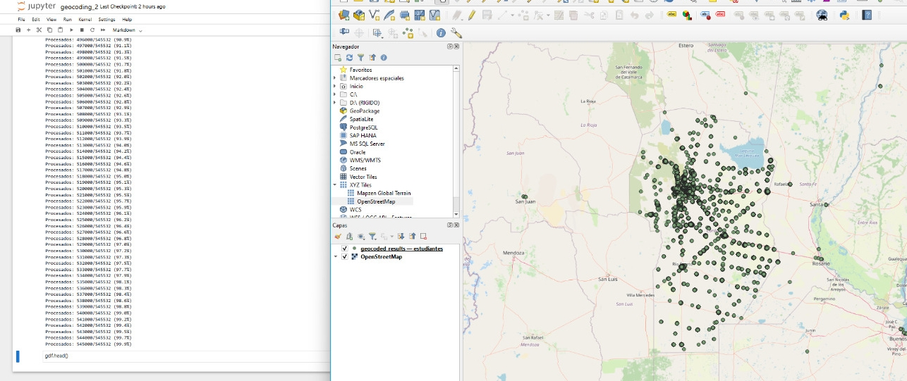

# Geocoding with Docker-Nominatim and Python

  

### 🚀 A parallelized geocoding workflow leveraging **Docker - Nominatim** and **Micromamba** to convert textual addresses into geographic coordinates (lat, lon). Developed remotely on the CCAD-UNC (High-Performance Computing Center, National University of Cordoba) via SSH connection. Results and datasets may be hidden due to privacy policies.  
-----------------------------------------------------------------------------------------------------------------------------------------------
This repository is designed for assigining geographic coordinates into textual addresses. You are encouraged to: 
- Adapt the workflow to your specific datasets, addresses and geographic regions.
- Integrate it into larger pipelines for batch processing or spatial analysis.
- Extend functionality by modifying parameters (i.e., Nominatim rate limits, parallel threasholds).
-----------------------------------------------------------------------------------------------------------------------------------------------

## ⚙️ Usage

- Follow the instructions from ssh_docker.txt
- Need Docker
- Need Python 3.8+ (`geopandas`, `geopy`, `jupyter notebooks`)
- Need Nominatim Docker image (e.g., [`mediagis/nominatim`](https://github.com/mediagis/nominatim-docker))

